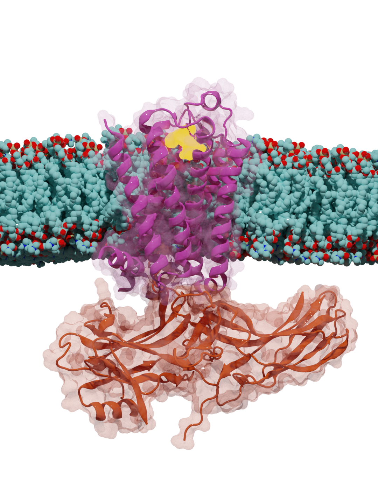
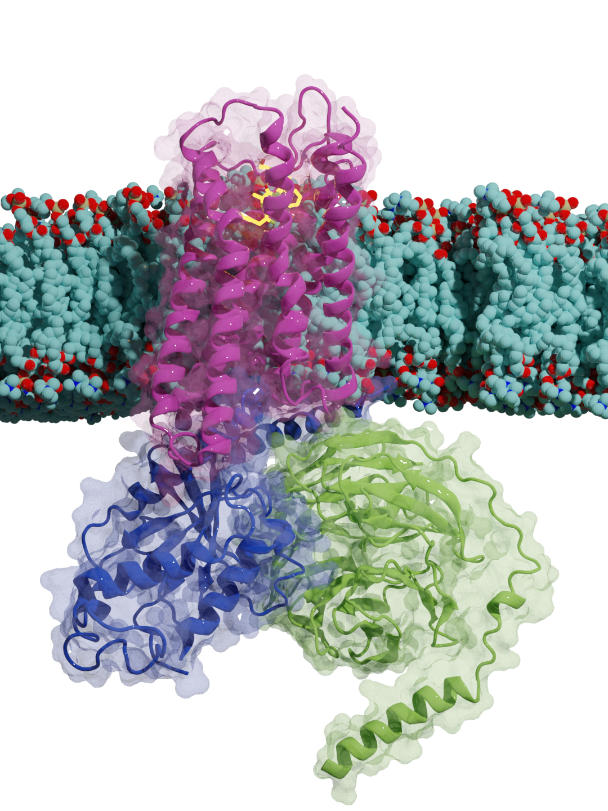

## Interested in creating beautiful 3D biomolecules digital art?
</a>
</a>
</a>

I mainly use the open-sourced software, Blender, for:
- rendering 3D images of biomolecules.
- rendering movies of molecular simulation trajectories. 

### To create HD 3D images:
Two ```.blend``` example files is located in the release code. It displays a lipid bilayer and its GPCR. This will serve as a guide for some ideal Blender settings, how to model a membrane and protein. 

Two great resources that guided me into this world are: 
- Crash course Blender by Blender Guru, especially [this beginner playlist](https://www.youtube.com/playlist?list=PLjEaoINr3zgEq0u2MzVgAaHEBt--xLB6U).
  - Note: Some settings deviate from Blender 2.8 in the videos and the newer Blender versions.
- Rendering 3D molecules into ultra-HD images by [Brady Johnson](https://www.youtube.com/c/BradyJohnston).

### To create HD movies of molecular simulation trajectories:
1. Load trajectory into [Visual of Molecular Dynamics (VMD)](http://www.ks.uiuc.edu/Research/vmd/).
2. Use the ```get_movie.tcl``` script to render an image for every frame of the trajectory. 
3. Import all the rendered images into the Blender Video Editing. 
4. Render and export your movie. More instructions on this in the release form under the ```.blend1``` file.

*The version of Blender that I use is Blender 3.2.0. I strongly recommend getting a GPU card if you are expecting reccurrent usage.*

**All rights reserved by Lexin Chen.**
